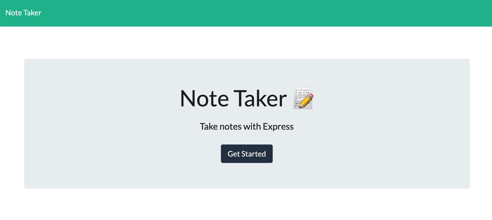
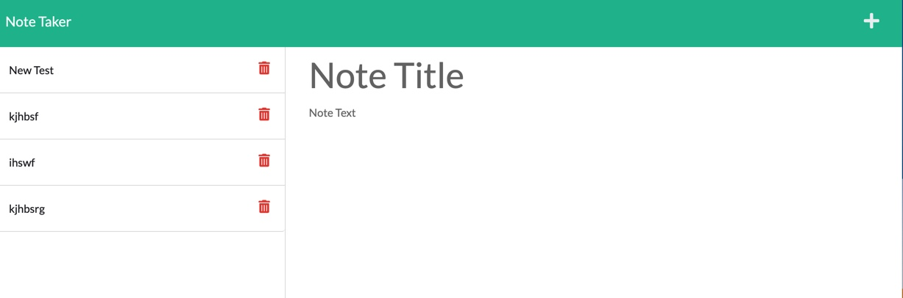

# Note-Taker

## Description

In this project, I created a note taker application, which implements express.js to create a backend server. This application allows the user to to add and delete notes from a list. The application has a homepage with a "Get Started" button that takes the user to a note taking page. There the user can create a title and content for the note, and then press the save button in the top right of the page to generate a saved note on the left third of the page. The user can then delete a note by pressing the red trash can button next to the saved note.

## License:  

## Table of Contents
1. [Description](#description)
2. [Installation](#installation)
3. [Usage](#usage)
4. [Credits](#credits)
5. [Contributing](#contributing)
6. [License](#license)
7. [Questions](#questions)

## Installation

In order for this application to work you will need the node environment installed on your computer. Adequate instructions for downloading the environment can be found at nodejs.org. To install all dependencies for this program, start by opening the server.js file in an integrated terminal and run "npm install". To view the project on a local host, run "node server.js" and go to the local host in your web browser.

## Usage
1. Once at the deployed website, click the "Get Started" button to navigate to the note taking page.

2. To add a note click on the plus symbol in the top right hand corner. Fill out a title and text for the note and click the save button that appears next to the add button. Your new note will appear on the left side of the page. 

3. To view a saved note, simply click inside of that note.
4. To delete a note, click the red trash can symbol.

The deployed website can be found via this link:  https://young-dusk-10287.herokuapp.com/

## Credits

- MDN Web Docs
- Tutor: Aaron Centeno
- npmjs.com
- VSCode
- StackOverflow

## Contributing

  
For contributing guidelines see link : https://www.contributor-covenant.org/

## License 
This Project is licensed under the MIT license.

* https://opensource.org/licenses/MIT

## Questions

Follow link for github: [Github Profile] (https://github.com/gallaghj13)  
For any additional questions you can reach me at: gallagherj0913@gmail.com